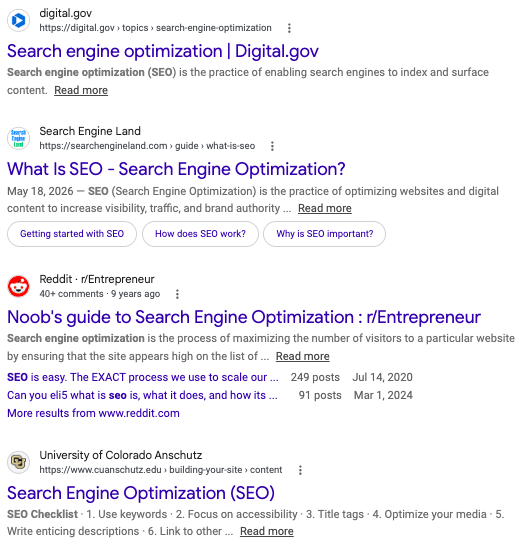
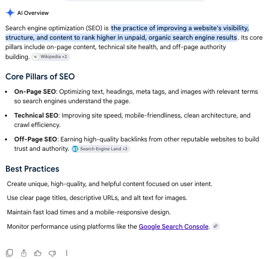
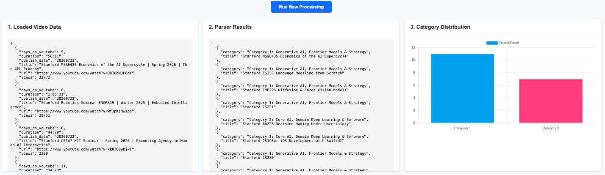
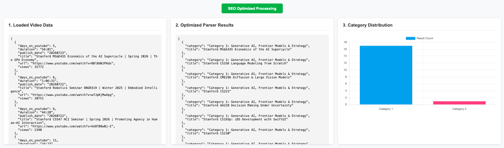

| Figure 1. Google Search Results | Figure 2. AI Search Results |
| :---: | :---: |
|  |  |

## **Introduction**
Traditional Google Search relies heavily on keyword matching. However, with the rise of Large Language Models (LLMs), AI-driven search goes beyond exact keywords to understand semantic context. This shift demands an evolution in Search Engine Optimization (SEO) strategies. Modern, AI-enabled SEO must optimize web content at a conceptual level so search engines can accurately map user intent to relevant pages. Using Stanford Online courses as a case study, this project demonstrates how to leverage Semantic SEO to optimize and promote content through a three-step workflow:

### **Steps:**
* **Step 1: Clustering** - Applied density-based clustering using YouTube view counts and duration online to categorize courses into frequently viewed, infrequently viewed, and outliers.

* **Step2: Topic Extraction** - Leveraged Large Language Models (LLMs) to extract and summarize key semantic topics across each cluster.

* **Step 3: Content Optimization** - Employed LLMs to rephrase titles and descriptions of underperforming courses, aligning them with high-performing semantic topics to improve visibility and engagement.

### **Results**
Figure 3. Raw Text Categorization
 

Figure 4. SEO-Optimized Text Categorization

## **How to run**
python app.py
